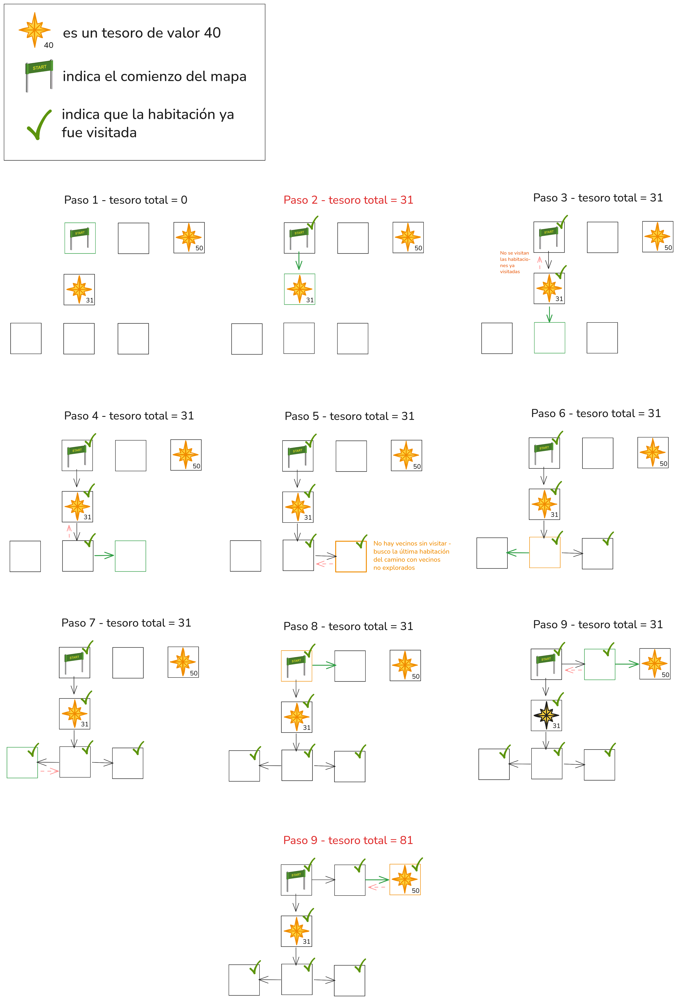

# Primer parcial - Arquitectura y Organización del Computador - Comision Furfi
### Segundo cuatrimestre 2025

- [Primer parcial - Arquitectura y Organización del Computador - Comision Furfi](#primer-parcial---arquitectura-y-organización-del-computador---comision-furfi)
    - [Segundo cuatrimestre 2025](#segundo-cuatrimestre-2025)
- [Normas generales y modalidad de entrega](#normas-generales-y-modalidad-de-entrega)
  - [Régimen de Aprobación](#régimen-de-aprobación)
  - [Conocimientos a evaluar](#conocimientos-a-evaluar)
  - [Compilación y Testeo](#compilación-y-testeo)
  - [Verificación de tests](#verificación-de-tests)
- [Enunciado](#enunciado)
  - [Estructuras:](#estructuras)
    - [Mapas y habitaciones](#mapas-y-habitaciones)
    - [Recorridos y acciones](#recorridos-y-acciones)
  - [Ejercicio 1](#ejercicio-1)
  - [Ejercicio 2](#ejercicio-2)
  - [Ejercicio 3](#ejercicio-3)


# Normas generales y modalidad de entrega

- El parcial es **INDIVIDUAL**
- Una vez terminada la evaluación se deberá crear un PR al `main` de su repo desde la branch con la resolución como source.

> [!CAUTION]
> Es importante que no modifiquen los archivos de los tester, si lo hacen se nos advertirá y tendremos que desaprobar la entrega automáticamente.
> 
> **Únicamente deben modificar manualmente los archivos:**
> - ej1.c y ej1.asm
> - ej2.c y ej2.asm 
> - ej3.c y ej3.asm
> - main.c de cada ejercicio
## Régimen de Aprobación

- El parcial es en los laboratorios, usando las compus de los labos o sus propias compus.
- Es a libro abierto, pueden tener todo lo que se les ocurra a disposición. Esta totalmente prohibido el uso del celular, internet y chatbots.
- Deberán conectarse a un proxy que limitará su acceso a internet para que únicamente se puedan conectar a GitHub. 
- Deberán correr un script que les proveeremos durante todo el parcial, mediante el que corroboramos que permanezcan conectados al proxy.
- **Sólo se evalúa programación en Assembly**, **C no se corrije** pero recomendamos que primero planteen una solución en C y después pasarla a Assembly cuando tengan en claro cómo estructurar la solución.
- Para aprobar el parcial deben implementar 2 de los 3 puntos del enunciado y que corran con éxito los tests funcionales, de abi y de memoria (valgrind).
- Vamos a usar herramientas de detección de plagio para asegurarnos de que su entrega sea original.

> [!NOTE]
> El comando `./tester.sh` corre los mismos tests que el juez online. Pueden usarlo para revisar que su parcial vaya a pasar los tests en dicho entorno.

> [!NOTE]
> Durante el parcial estaremos disponibles para resolver consultas de enunciado y para destrabarles si están dando vueltas mucho tiempo en algo que no forma parte de lo evaluado. NO responderemos preguntas teóricas.


## Conocimientos a evaluar 
- Uso de memoria dinámica.
- Navegación de punteros.
- Representación binaria de los tipos de datos.
- Manejo de pila.
- Manejo de structs.
- Convención C, ABI, uso de registros.
- Uso del debugger GDB.

## Compilación y Testeo

Para compilar y ejecutar los tests cada ejercicio dispone de un archivo
`Makefile` para cada uno, con los siguientes *targets*:

| Comando             | Descripción                                                         |
| ------------------- | ------------------------------------------------------------------- |
| `make test_c`       | Genera el ejecutable usando la implementación en C del ejercicio.   |
| `make test_asm`     | Genera el ejecutable usando la implementación en ASM del ejercicio. |
| `make test_abi`     | Genera usando la implementación en ASM del ejercicio + archivos necesarios para ABI enforcer |
| `make run_c`        | Corre los tests usando la implementación en C.                      |
| `make run_asm`      | Corre los tests usando la implementación en ASM.                    |
| `make run_abi`      | Corre los tests usando la implementación en ASM + ABI enforcer.     |
| `make valgrind_c`   | Corre los tests en valgrind usando la implementación en C.          |
| `make valgrind_asm` | Corre los tests en valgrind usando la implementación en ASM.        |
| `make valgrind_abi` | Corre los tests en valgrind usando la implementación en ASM + ABI enforcer        |
| `make check_offsets` | Corre el chequeo de offsets                                         |
| `make run_main_c`        | Corre main usando la implementación en C.                      |
| `make run_main_asm`      | Corre main usando la implementación en ASM (no corre ABI enforcer).                    |
| `make clean`        | Borra todo archivo generado por el `Makefile`.                      |


## Verificación de tests
Para el parcial, contamos con una máquina de la facultad para correr los tests en un entorno limpio y controlado. La idea es que ustedes trabajen en su branch, haciendo los commits y push que necesiten, hasta tener los tests pasando en su computadora local.

> [!CAUTION]
> Para considerar un ejercicio aprobado, debe pasar los tests **con el comando** `make valgrind_abi`

Una vez que tengan el parcial para entregar, proceden a revisar su aprobación del siguiente modo:
- Crean un PR de `su branch` a `main` con los cambios a entregar
- **PARA CORRER LOS TESTS, DEBEN AGREGAR UNA ETIQUETA (label) AL PR**, verán en su repositorio que aparece una label `tests` a tal fin
- Cuando se detecte que agregaron la label, denle uno o dos minutos (puede tardar más si hay muchas personas entregando al mismo tiempo) y comenzarán a correr los tests. El estado se informará en la ventana del PR donde figura el botón para hacer merge.
- Eventualmente terminarán los tests y dirá si pasaron (aprobado) o no. Pueden revisar el progreso si hacen click en el nombre de la corrida en curso.
- **No hacer el merge a main del PR**

> [!NOTE]
> Si hacen cambios y quieren volver a correr los tests, deben SACAR LA ETIQUETA, guardar el cambio (pueden refrescar la pagina por ejemplo) Y VOLVER A AGREGAR LA ETIQUETA

# Enunciado
Es fin de cuatrimestre y por fin llegaron las tan esperadas vacaciones que venimos planeando hace semanas.

Las vacaciones serán toda una aventura: Nos encontramos en un hotel en donde hay múltiples **habitaciones conectadas** entre sí. Cada habitación tiene un **contenido** propio y a nosotros nos interesa encontrar las habitaciones que contienen **tesoros**. 

En nuestra mano, tenemos un **mapa** que contiene un listado de todas las habitaciones y cómo se conectan entre sí. A partir del mismo, vamos a realizar un **recorrido** entre las distintas habitaciones conectadas, siguiendo distintas directivas.

Tenemos las siguientes estructuras para representar el `Mapa`, el `Recorrido`, la `Habitacion` y el `Contenido` de una habitación, además de las direcciones (acciones) que se realizan en un recorrido:

## Estructuras: 

### Mapas y habitaciones
```C
typedef struct {
    Habitacion *habitaciones;
    uint64_t n_habitaciones;
    uint32_t id_entrada;
} Mapa;
```
- Las habitaciones están enumeradas del 0 a N, siendo la habitación 0 la primera que está siendo apuntada por `habitaciones`.
- `id_entrada` es el índice de la habitación en la que **comienza** nuestro recorrido. 

```C
typedef struct {
    uint32_t id;
    uint32_t vecinos[ACC_CANT];
    Contenido contenido;
    uint32_t visitas;
} Habitacion;
```
- Una habitación está formada por sus `vecinos` (las otras habitaciones que se conectan con ella) y un `contenido`.
- A lo sumo, una habitación puede tener **4 vecinos**.
- El array `vecinos` se indexa por `accion`. Por ejemplo `vecinos[3]` contine el id de la habitación que conecta por el oeste, ya que `ACC_OESTE` es `3`. Si no hay vecino en esa dirección, el valor del índice será 99.
- Se puede asumir que hay menos de 99 habitaciones en el mapa.
- Prestar atención al tipo del atributo `contenido`, cualquier cosa consultar.

```C
typedef struct {
    char nombre[64];
    uint32_t valor;
    char color[32];
    bool es_tesoro;
    float peso;
} Contenido;
```
- El contenido de una habitación informa si la misma contiene o no un tesoro a través de `es_tesoro`.
- Un tesoro tiene un `valor` que nos interesará contabilizar.

### Recorridos y acciones
```C
typedef struct {
    Accion *acciones;
    uint64_t cant_acciones;
} Recorrido;
```
- Un recorrido es una secuencia de `acciones`

```C
typedef enum {
    ACC_NORTE = 0,
    ACC_SUR,
    ACC_ESTE,
    ACC_OESTE,
    ACC_CANT
} Accion;
```
- Las acciones vienen representadas por un `enum` para que resulten más legibles. Recuerden que un `enum` es, al fin y al cabo, una **enumeración del 0 a N** de los elementos que pertenecen al mismo.

## Ejercicio 1

Una vez iniciado el viaje y llegado al punto de entrada indicado en el mapa, se desea implementar la función:

```C
bool encontrarTesoroEnMapa(Mapa *mapa, Recorrido *rec, uint64_t *acciones_ejecutadas)
```

Esta función debe recorrer el `mapa` siguiendo, en orden, las acciones indicadas en el recorrido `rec`, comenzando desde la habitación de entrada indicada por el `id_entrada` definido en `mapa`. 

A medida que avanza, debe determinar si en alguna de las habitaciones visitadas hay un tesoro. La función debe devolver `true` en caso de encontrar al menos un tesoro durante el recorrido; `false` si no. 

La variable apuntada por `acciones_ejecutadas` lleva un **conteo** de las **acciones** realizadas. La misma debe actualizarse para reflejar cuántas acciones se **ejecutaron efectivamente** hasta finalizar el recorrido.

Un recorrido puede finalizar porque:
- Encontramos un tesoro
- Se terminó el recorrido que estábamos siguiendo
- Estamos intentando realizar una acción inválida dentro de la habitación (por ejemplo, queremos ir hacia el *Norte*, pero no hay ninguna habitación vecina en esa dirección)

> [!NOTE]
> Por ejemplo, dados los siguientes argumentos:

```C
    Accion acciones[] = { ACC_OESTE, ACC_SUR };
    Recorrido rec = { acciones, 2 };
    uint64_t acciones_ejecutadas = 0;
	bool found = encontrarTesoroEnMapa(Mapa *mapa, Recorrido *rec, uint64_t *acciones_ejecutadas);
```

> El valor de `found` será `true` si, con el recorrido OESTE → SUR encontramos un tesoro en alguna de las 3 habitaciones (la entrada, la que está al oeste de la entrada, o la que está al sur de esta última), y `false` en caso contrario.


> [!NOTE]
> De haber más de un tesoro en el recorrido nos quedamos solo con el primero de todos, ya que los recorridos finalizan al encontrarse un tesoro.


## Ejercicio 2

Luego de haber encontrado (o no) el tesoro durante nuestra aventura, llega el momento de volver al punto de partida. Para ello, queremos construir automáticamente el recorrido de regreso a partir del camino que realizamos para llegar a dónde llegamos.

Para volver, no basta con seguir el recorrido de atras para adelante. Tenemos que deshacer nuestros pasos empezando por el último que dimos, invirtiendo el sentido de cada acción.

Imaginemos que para llegar al tesoro hicimos esto:

1. Caminamos al Oeste.
2. Luego bajamos al Sur.
3. Finalmente doblamos al Este y encontramos un tesoro.

Para salir, debemos "deshacer" estas acciones en **orden inverso**:

1. Si lo último fue ir al Este, lo primero que hacemos ahora es ir al Oeste.
2. Si fuimos al Sur, ahora vamos al Norte.
3. Si empezamos yendo al Oeste, terminamos yendo al Este.

Se desea implementar una función que, dado un recorrido, construya un **nuevo recorrido** que represente el camino inverso:

```C
Recorrido *invertirRecorridoConDirecciones(const Recorrido *rec, uint64_t len);
```

> [!NOTE]
> Sugerimos armarse una función auxiliar que dada una acción devuelve la acción inversa.

## Ejercicio 3

Después de explorar el mapa y diseñar el camino de ida y vuelta, queremos saber cuánto valen en total los tesoros que podríamos llegar a recolectar en toda nuestra aventura. Para esto, disponemos nuevamente del mapa completo y de la información de cada habitación, incluyendo si en ella hay un tesoro, su valor y su peso.

Se pide implementar entonces la función:

```C
uint32_t sumarTesoros(Mapa *mapa, uint32_t actual, bool *visitado);
```
Esta función debe recorrer el mapa en **forma recursiva**, comenzando desde la habitación indicada por `actual`, y acumular el valor de todos los tesoros que cumplan ciertas condiciones. 

Para evitar contar dos veces el mismo tesoro en mapas con ciclos o múltiples caminos hacia una misma habitación, la función provee además un arreglo `visitado`, en donde la i-ésima posición del arreglo indica si la i-ésima habitación ya fue visitada.

> [!NOTE]
> En cada llamada, la función debe:
>
> - Verificar que el índice actual sea válido y que la habitación no haya sido visitada antes; en caso contrario, no sumar nada y simplemente retornar 0.
> - Marcar la habitación actual como visitada.
> - Si la habitación actual contiene un tesoro, sumar su valor al total acumulado.
> - Recorrer recursivamente todas las habitaciones vecinas alcanzables desde la habitación actual, acumulando los valores de los tesoros encontrados en el camino. 
> - El valor de retorno de la función debe ser la suma total de los valores de todos los tesoros que cumplan la condición de peso y que sean alcanzables desde la habitación inicial, sin repetir habitaciones.

